---
lab:
    title: 'Prepare'
---
> **Note:** This guided project requires an active Azure subscription. Where possible, follow recommended naming conventions to make it easier to clean up the resource for this project at the end. Creating and using Azure resources for this project may increase your Azure costs.

In the prepare exercise, you set up the environment to complete the rest of the steps. 

## Need an Azure account?
If you already have a Microsoft Azure account to use for this lab, skip to **Login to Microsoft Azure**. If you need to create an Azure account, complete the following steps.
1.	Go to the Azure free account page.
2.	Select **Try Azure for free**
3.	Complete the sign-up process for an Azure account. 

## Login to Microsoft Azure
1.	Login to Microsoft Azure at [https://portal.azure.com](https://portal.azure.com)

## Create a resource group
In order to make clean-up easy at the end, start with creating a new resource group to hold the resources for this guided project. Using resource groups to organize things is a quick way to ensure you can manage resources when a project is over.
1.	From the Azure portal home page, in the search box, enter resource groups.
2.	Select **Resource groups** under services.
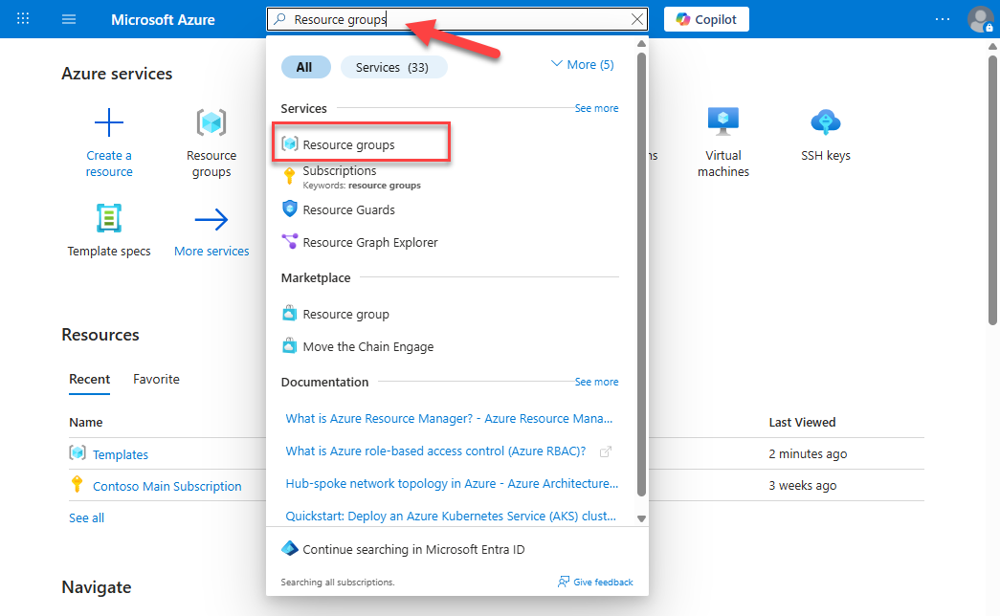
3.	 Select **Create**.
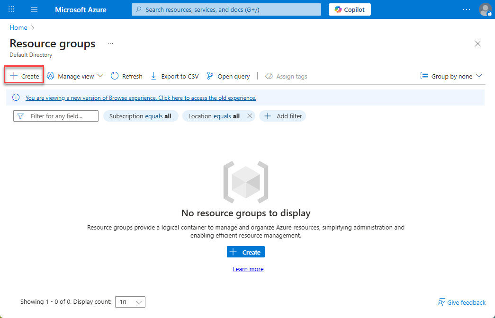
> **Note:** Your subscription should already be selected. If you have multiple Azure subscriptions associated with this login, select the one you’d like to use for the guided project.
4.	Enter `guided-project-rg` in the **Resource group name** field.
5.	The **Region** field will automatically populate. Leave the default value.
6.	Select **Review + create**.
7.	Select **Create**.
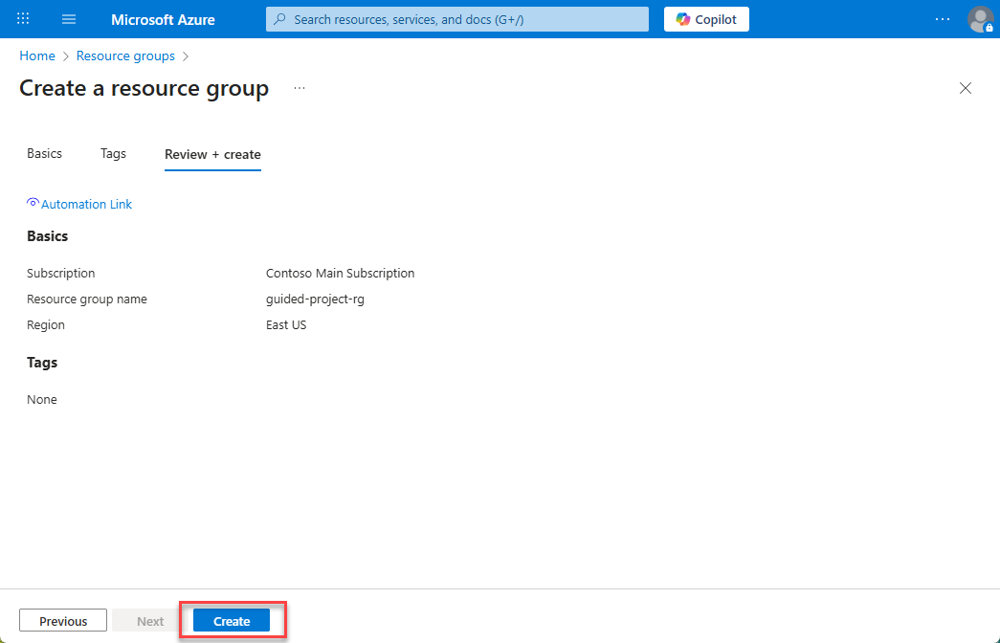
8.	Return to the home page of the Azure portal by selecting **Home**.
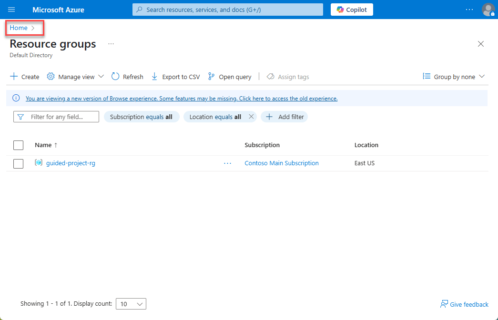

## Create a virtual network with one subnet
1.	From the Azure portal home page, in the search box, enter **virtual networks**.
2.	Select **virtual networks** under services.
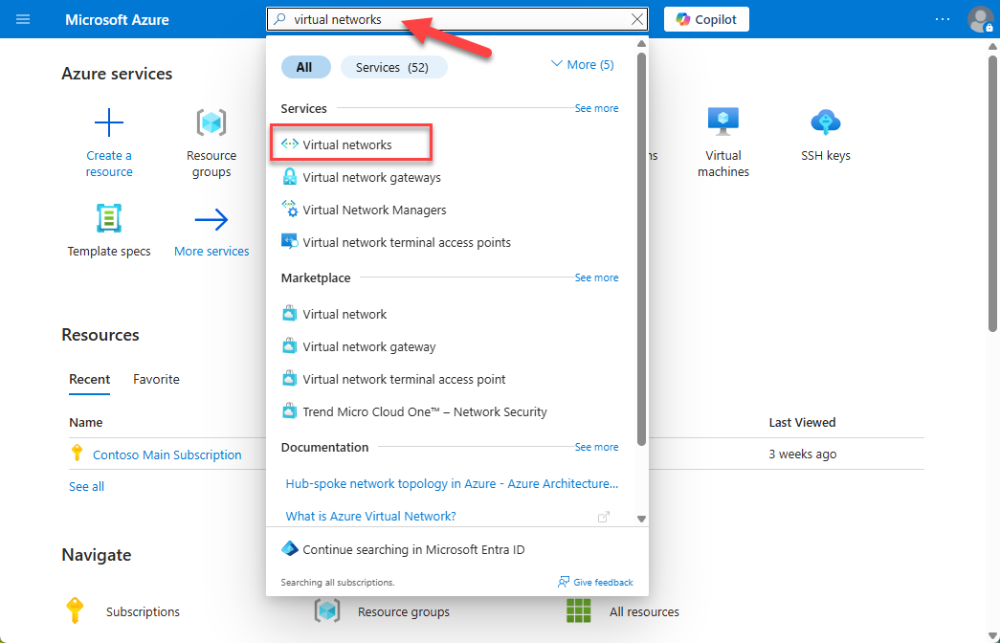
3.	Select **Create**.
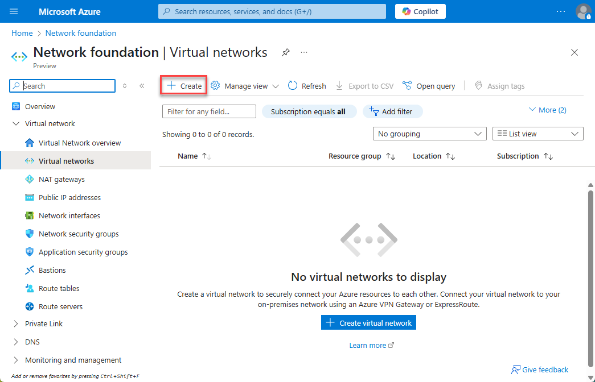
> **Note:** The subscription and resource group should automatically fill in. Verify that the information filled in matches the correct subscription and the new resource group created for the guided project (guided-project-rg if you’re following along with the naming conventions).
4.	Scroll down to the **Instance details** section and `guided-project-vnet` for the Virtual network name.
5.	Select **Review + create**.
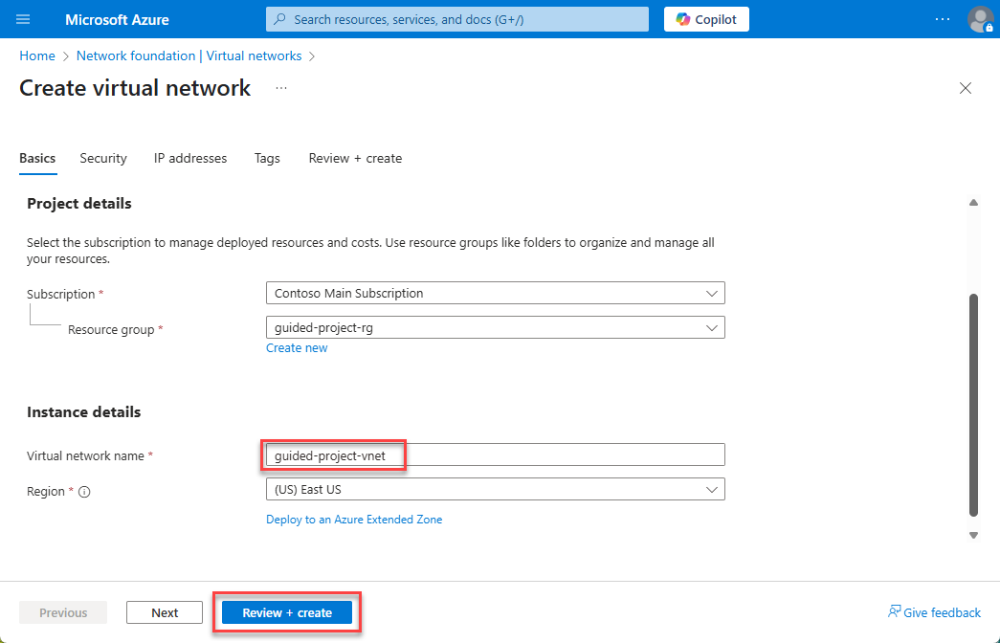
6.	Select **Create**.
7.	Wait for the screen to refresh and show **Your deployment is complete**.
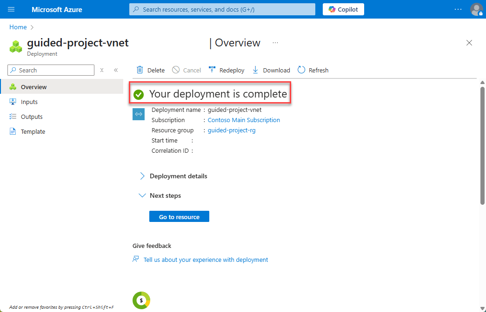
8.	Select **Home** to return to the Azure portal home page.

## Create a virtual machine
1.	From the Azure portal home page, in the search box, enter **virtual machines**.
2.	Select **virtual machines** under services.
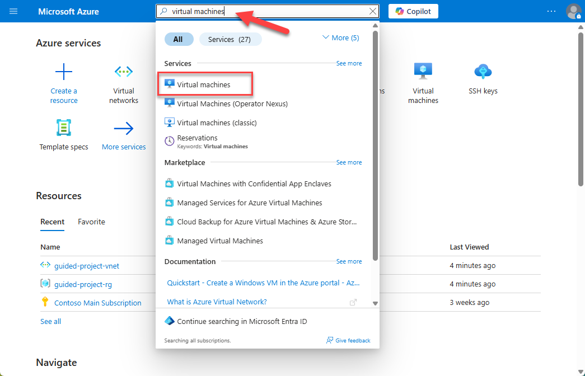
3.	Select **Create** and then select **Virtual machine**
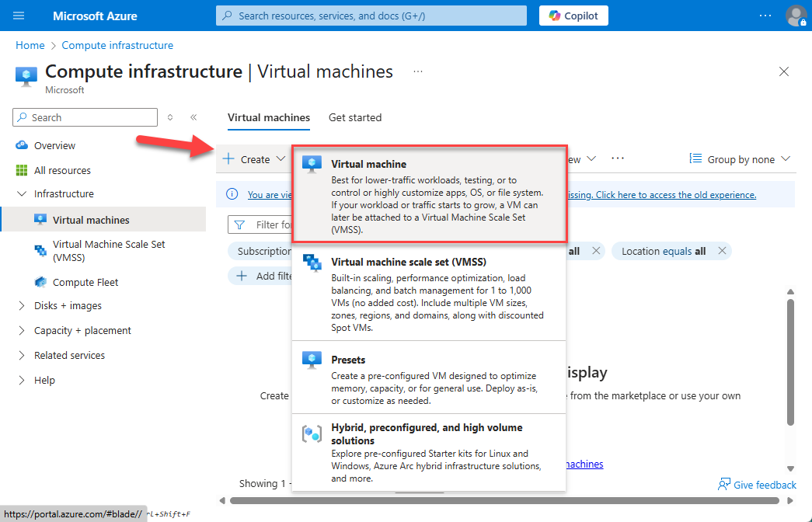
> **Note:** The subscription should automatically fill in. Verify that the information filled in matches the correct subscription.
4.	Select **guided-project-rg** for the **Resource group**.
5.	Enter `guided-project-vm` for the **Virtual machine name**.
6.	Continue further on the **Basics** page to the **Administrator account** section.
7.	Select **Password** for authentication type.
8.	Enter ` guided-project-admin` for the admin **Username**.
9.	Enter a password for the admin account.
10.	Confirm the password for the admin account.
11.	Leave the rest of the settings as default settings. You can review the settings if you like, but shouldn’t change any.
12.	Select **Review + create**.
> **Note:** Once validation has passed, you’ll receive a cost estimate of how much it will cost per hour to run the VM.
13.	Select **Create** to confirm the resource cost and create the virtual machine.
14.	 **Instance details** section and `guided-project-vnet` for the Virtual network name.
15.	Wait for the screen to refresh and show **Your deployment is complete**.
16.	Select **Home** to return to the Azure portal home page.

## Create a Storage account
1.	From the Azure portal home page, in the search box, enter **storage accounts**.
2.	Select **Storage accounts** under services.
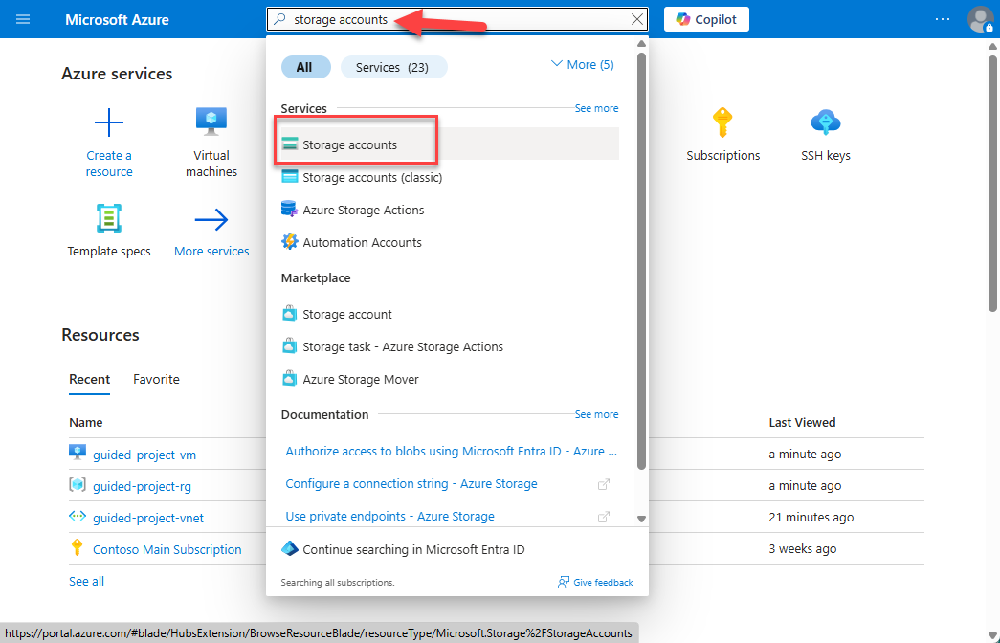
3.	Select **Create**.

> **Note:** The subscription and resource group should automatically fill in. Verify that the information filled in matches the correct subscription and the new resource group created for the guided project (guided-project-rg if you’re following along with the naming conventions).
4.	Scroll down to the **Instance details** section and enter a name for the storage account. Storage accounts must be globally unique, so you may have to try a few different times to get a storage account name.
5.	Select **Review + create**.
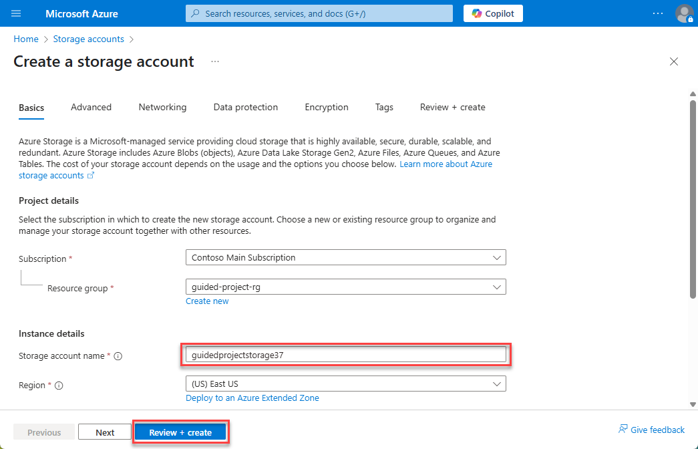
6.	Select **Create**.
7.	Wait for the screen to refresh and show **Your deployment is complete**.
8.	Select **Home** to return to the Azure portal home page.
