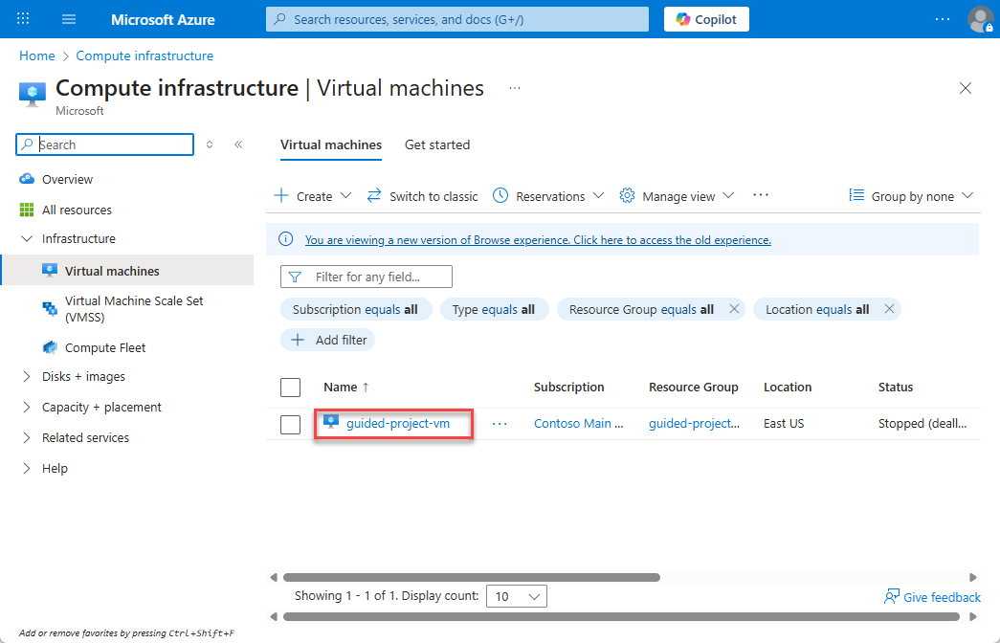
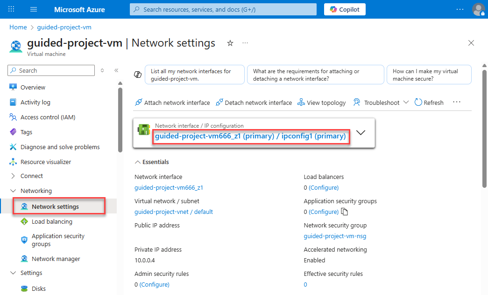
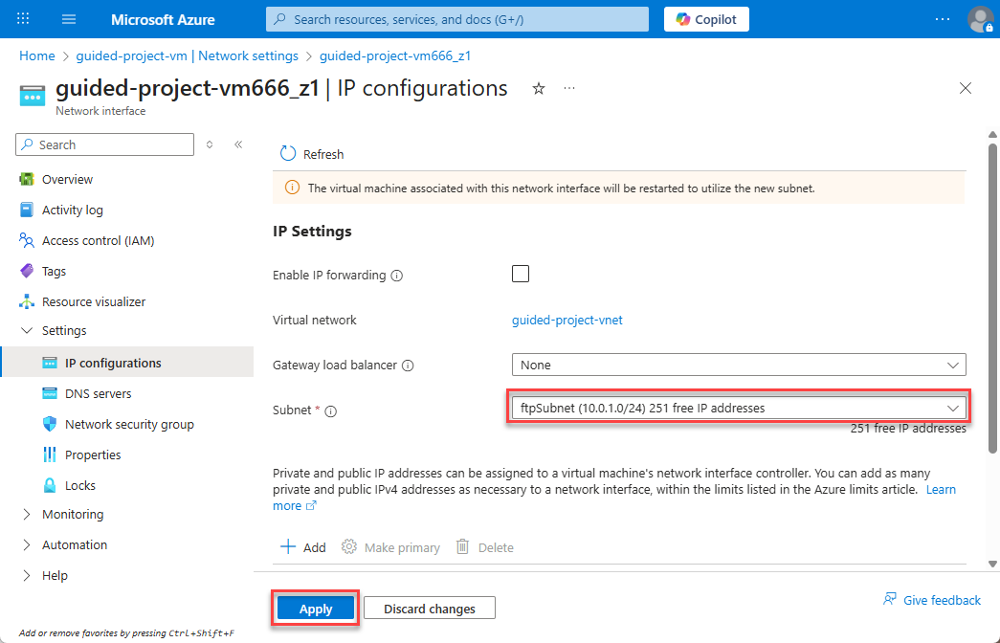
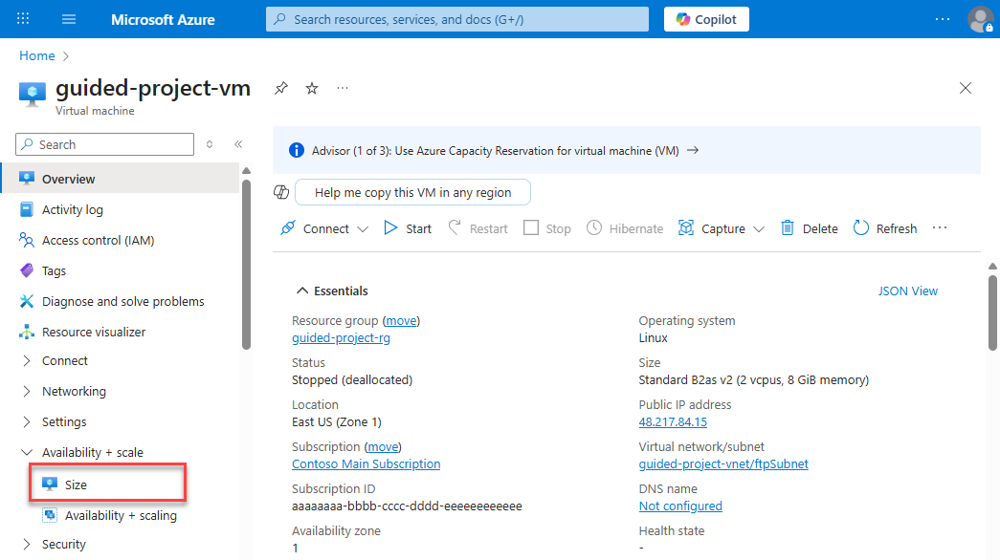
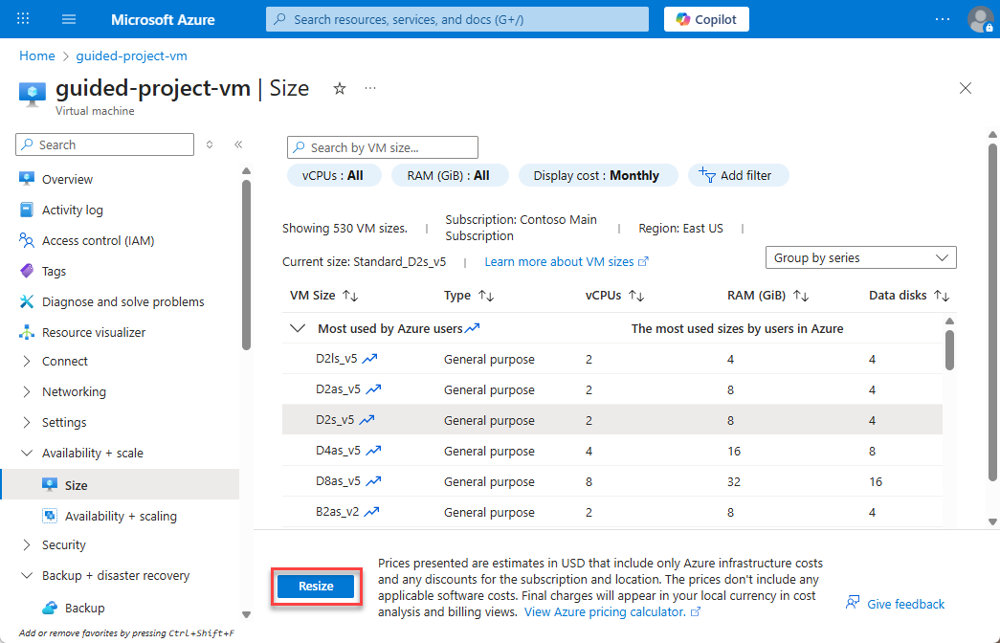
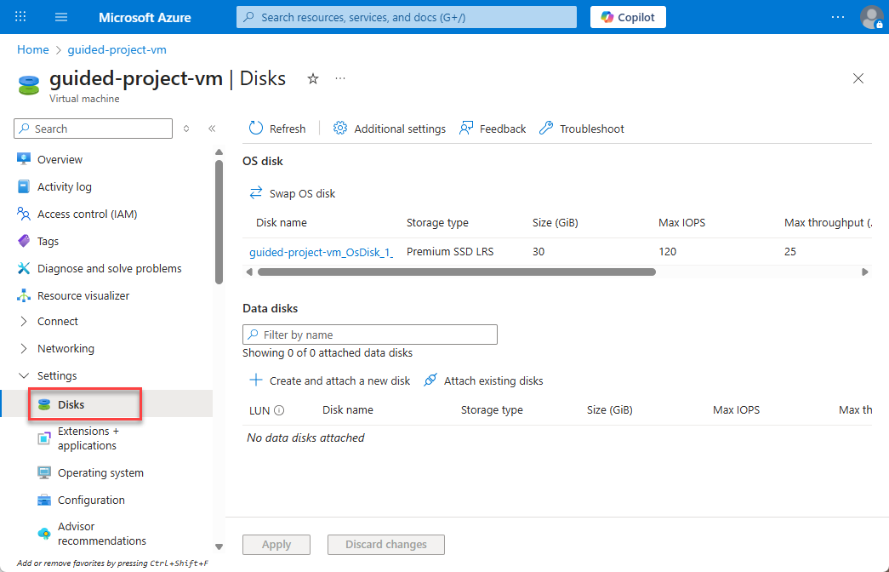
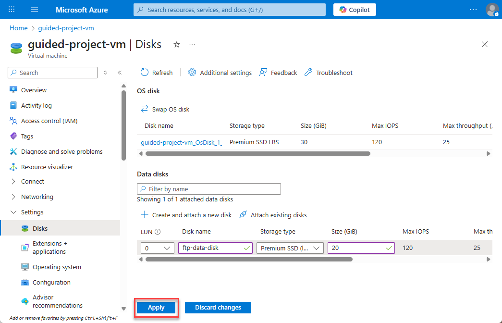

---
lab:
    title: 'Exercise – Manage virtual machines'
---

# Exercise – Manage virtual machines
In this exercise, you’ll complete several tasks related to managing virtual machines.

## Scenario
With the network settings updated to support segmenting the Linux virtual machine, you’re ready to manage the virtual machine itself. The first thing the Azure admin asks you to complete is moving the virtual machine to the new subnet you created in the previous exercise.

## Move the virtual machine network to the new subnet
1.	Login to Microsoft Azure at [https://portal.azure.com](https://portal.azure.com)
2.	From the Azure portal home page, in the search box, enter **virtual machines**.
3.	Select **virtual machines** under services.
4.	Select the *guided-project-vm* virtual machine.

5.	If the virtual machine is running, select **Stop**.
> **Note:** In order to make some configuration changes, such as changing the subnet, the VM will need to be restarted. You can request the change without stopping the VM, but Azure will force a restart before completing the change.
6.	Wait for the **Status** field to update and show **Stopped (deallocated)**.
7.	Within the **Networking** subsection of the menu, select **Network settings**.
8.	Select the Network interface / IP configuration hyperlink for the VM.

9.	On the **IP Configurations** page, update the **Subnet** to *ftpSubnet*.
10.	Select **Apply*.

11.	Select **Home** to return to the Azure portal home page.
Good job! You’ve migrated the VM from one subnet to another. Remember, the new subnet had specific network security rules applied to help it function as an FTP server.
The next task from the Azure admin relates to the computing power of the VM. The admin would like you to vertically scale the machine to increase the computing power.

## Vertically scale the virtual machine
1.	From the Azure portal home page, in the search box, enter **virtual machines**.
2.	Select **virtual machines** under services.
3.	Select the *guided-project-vm* virtual machine.
4.	Locate the **Availability + scale** submenu and select **Size**.

5.	Select a new VM size **D2s_v5** for example. *(Note: If you don’t see the same size as shown in this exercise, select something similar.)*
6.	Select **Resize**.

> **Note:** The VM size may not update in the Azure UI until the VM is restarted.
7.	Select **Home** to return to the Azure portal home page.
Well done. With the VM scaled up to a more robust processor, it can handle the new role it’s being assigned.
However, now the Azure admin realizes that if the VM is going to server as an FTP server, it needs more storage. The Azure admin asked you to attach a new data disk to the VM.

## Attach data disks to a virtual machine
1.	From the Azure portal home page, in the search box, enter **virtual machines**.
2.	Select **virtual machines** under services.
3.	Select the *guided-project-vm* virtual machine.
4.	Locate the **settings** submenu and select **Disks**.

5.	Select **Create and attach a new disk**.
6.	Leave LUN as default.
7.	Enter `ftp-data-disk` for the **Disk name**.
8.	Leave the Storage type as default.
9.	Enter `20` for the **Size**.
10.	Select **Apply** to create the new storage disk and attach the disk to the machine.

11.	Select **Home** to return to the Azure portal home page.

Nice! Now the VM has enough storage to handle some uploads.

## Configure automatic shutdown on a virtual machine
The final thing the Azure admin is concerned about is the cost of running the computer 24 hours a day. The first thing they’ll do every morning is start up the FTP server. However, they’d like you to configure it to automatically shutdown every day at 7 PM Coordinated Universal Time (UTC).
1.	From the Azure portal home page, in the search box, enter **virtual machines**.
2.	Select **virtual machines** under services.
3.	Select the *guided-project-vm* virtual machine.
4.	Under the **Operations** submenu, select **Auto-shutdown**.

5.	In order to let late uploads finish, set the **Scheduled shutdown** to `7:15:00 PM`.
6.	Select **Save**.

7.	Select **Home** to return to the Azure portal home page.

Congratulations! You’ve successfully completed all of the management tasks the Azure admin needed a hand with for the virtual machine.
