---
lab:
    title: 'Exercise – Control storage access'
---
# Exercise – Control storage access
In this exercise, you’ll complete several tasks related to managing a storage account and components of the storage account.

## Scenario
The Azure admin wants you to get more familiar with storage accounts, containers, and file shares. They anticipate needing to share an increasing number of files and need someone who is skilled using these services. They’ve given you a task of creating a storage container and a file share and uploading files to both locations.

## Create a storage container
1.	Login to Microsoft Azure at [https://portal.azure.com](https://portal.azure.com)
2.	From the Azure portal home page, in the search box, enter **storage accounts**.
3.	Select **storage accounts** under services.
4.	Select the storage account you created in the **Prepare** exercise. The storage account **name** is the hyperlink to the storage account. *(Note: it should be associated with the resource group **guided-project-rg**.)*
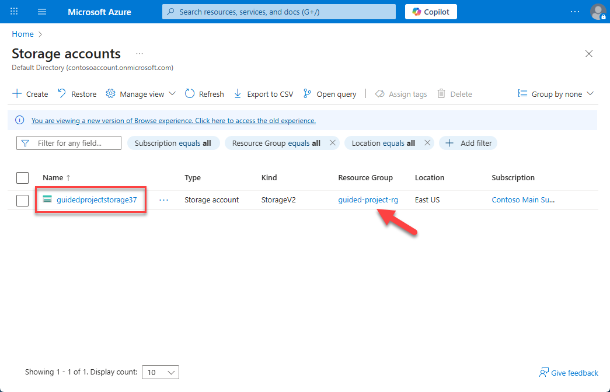
5.	On the storage account blade, under the **Data storage** submenu, select **Containers**.
6.	Select **+ Add container**.
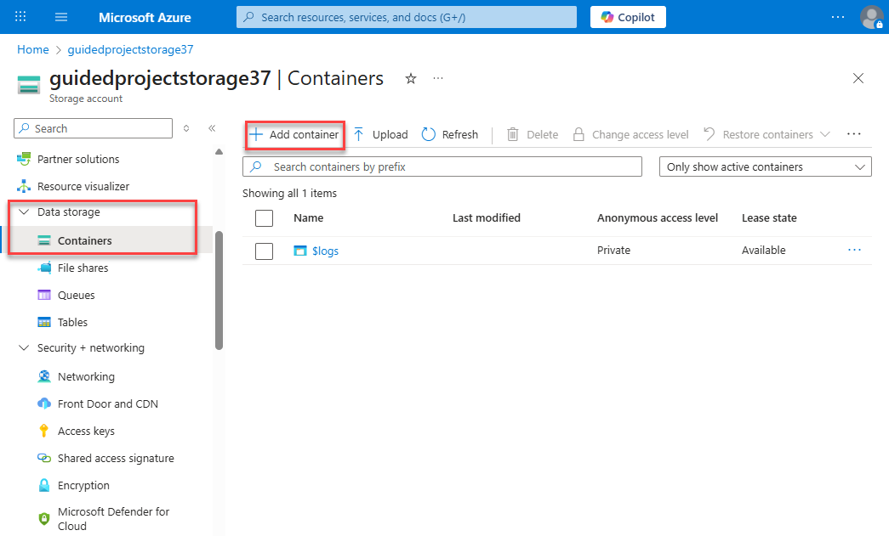
7.	In the **Name** field, enter `storage-container`.
8.	Select **Create**.
Great! With a storage container created, you can upload a blob to the container. Locate a picture that you can upload, either on your computer or from the internet, and save it locally to make uploading easier.

### Upload a file to the storage container and upload a file
1.	Select the storage container you just created.
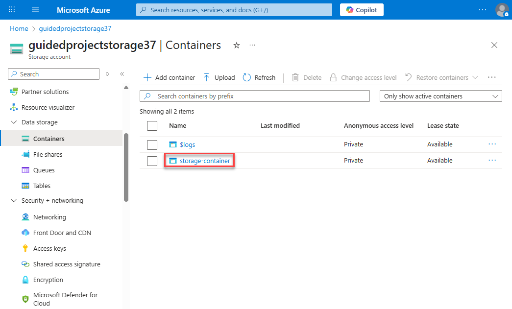
2.	Select **Upload** and upload the file you prepared.
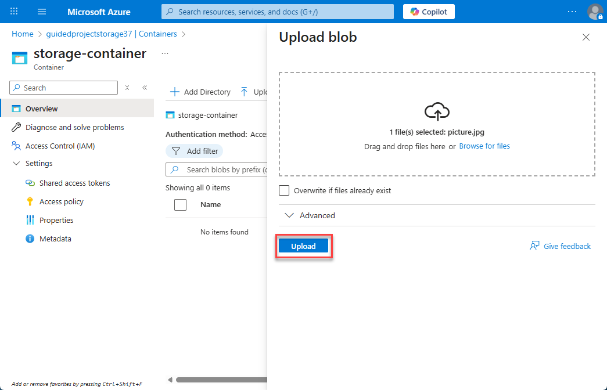
3.	Once the file is ready for upload, select **Upload**.
With the file uploaded, notice that the Access tier is displayed. For something we uploaded just for testing, it doesn’t need to be assigned to the **Hot** access tier. In the next few steps, you’ll change the access tier for the file.

### Change the access tier
1.	Select the file you just uploaded (the file name is a hyperlink).
2.	Select **Change tier**.
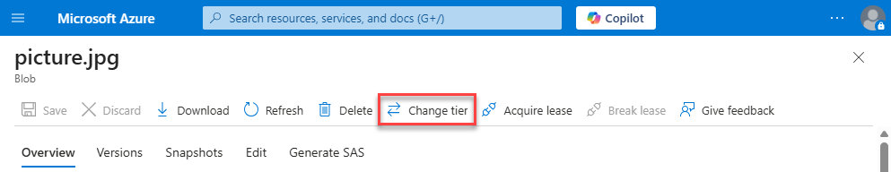
3.	Select **Cold**.
4.	Select **Save**.
> **Note:** You just changed the access tier for an individual blob or file. To change the default access tier for all blobs within the storage account, you could change it at the storage account level.
5.	Select **Home** to return to the Azure portal home page.

Good job! You’ve successfully uploaded a storage blob and changed the access tier from Hot to Cold.
Next, you’ll work with file shares.

## Create a file share
1.	From the Azure portal home page, in the search box, enter **storage accounts**.
2.	Select **storage accounts** under services.
3.	Select the storage account you created in the **Prepare** exercise. The storage account **name** is the hyperlink to the storage account. *(Note: it should be associated with the resource group **guided-project-rg**.)*
4.	On the storage account blade, under the **Data storage** submenu, select **File shares**.
5.	Select **+ File share**.
6.	On the **Basics** tab, in the name field enter `file-share`.
7.	On the **Backup** tab, uncheck **Enable backup**.
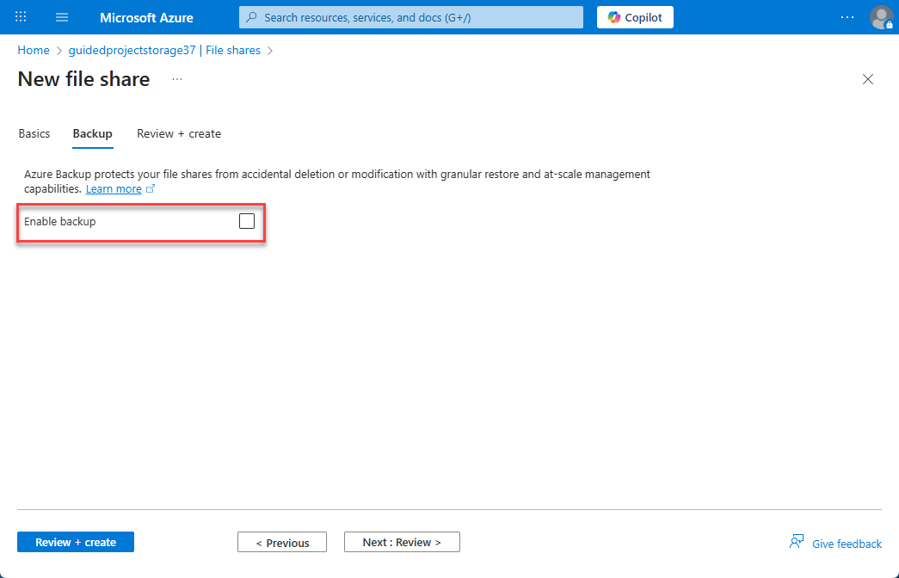
8.	Select **Review + create**.
9.	Select **Create**.
10.	Once the file share is created, select **Upload**.
11.	Upload the same file you uploaded to the blob storage or a different file, it’s up to you.
12.	Select **Home** to return to the Azure portal home page.

The next piece of the puzzle is figuring one way to control access to the files that have been uploaded. Azure has many ways to control files, including things like role-based access control. In this scenario, the Azure admin wants you to use shared access tokens or keys. 

## Create a shared access signature token
1.	From the Azure portal home page, in the search box, enter **storage accounts**.
2.	Select **storage accounts** under services.
3.	Select the storage account you created in the **Prepare** exercise.
4.	On the storage account blade, select **Storage browser**.
5.	Expand **Blob containers**.
> **Note:** Blob container is another name for the storage containers. Items uploaded to a storage container are called **blobs**.
6.	Select the storage container you created earlier, **storage-container**.

7.	Select the ellipses (three dots) on the end of the line for the image you uploaded.
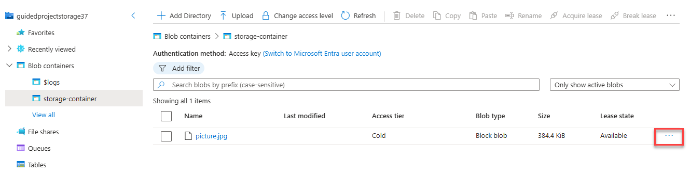
8.	Select **Generate SAS**.
> **Note: When you generate a shared access signature, you set the duration. Once the duration is over, the link stops working. The **Start** automatically populates with the current date and time.
9.	Set **Signing method** to **Account key**.
10.	Set **Signing key** to **Key 1**.
> **Tip:** There are two signing keys available. You can choose either one, or create SAS tokens with different durations.
11.	Set **Stored access policy** to **None**.
12.	Set **Permissions** to **Read**.
13.	Enter a custom start and expiry time or leave the defaults.
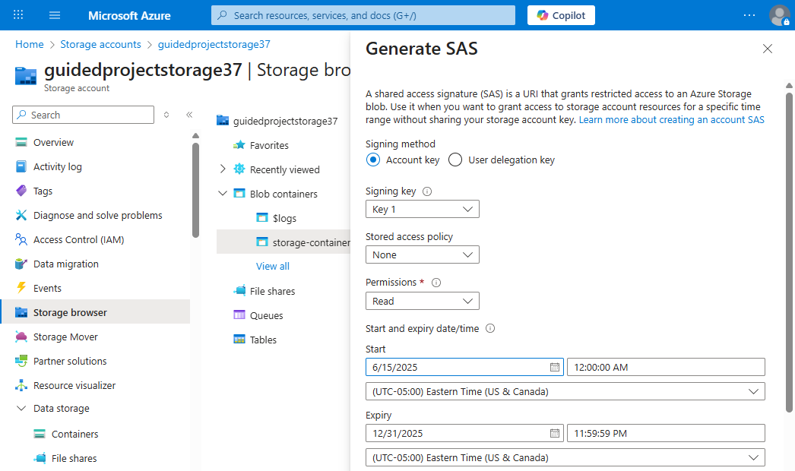
14.	Set **Allowed protocols** to **HTTPS only**.
15.	Select **Generate SAS token and URI.**
16.	Copy the **Blob SAS URL** and paste it in another window or tab of your browser. It should display the image you uploaded. Keep this tab or window open.
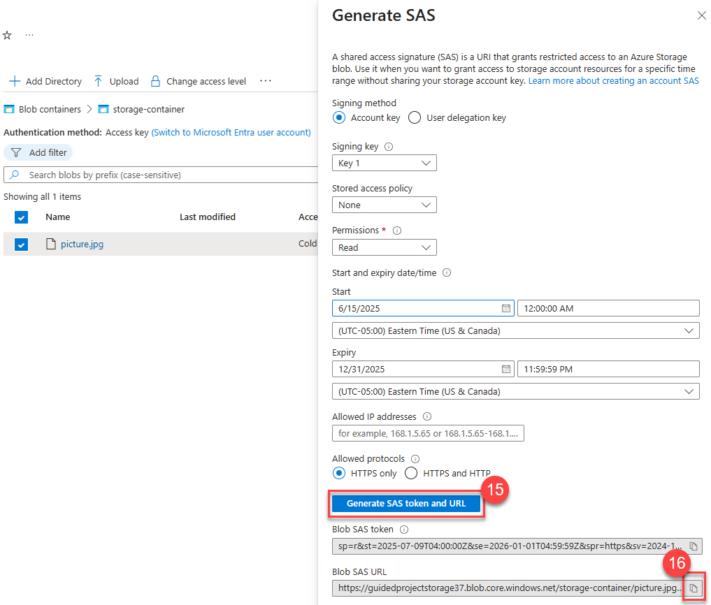
> **Tip:** You can configure SAS tokens for files shares and blob containers using the same process.
17.	Select **Home** to return to the Azure portal home page.

With the SAS token created, anyone with that link can access the file for the duration that was set when you created the SAS token. However, controlling access to a resource or file is about more than just granting access. It’s also about being able to revoke access. To revoke access with a SAS token, you need to invalidate the token. You invalidate the token by rotating the key that was used.

## Rotate access keys
1.	From the Azure portal home page, in the search box, enter **storage accounts**.
2.	Select **storage accounts** under services.
3.	Select the storage account you created in the **Prepare** exercise.
4.	Expand the **Security + networking** submenu.
5.	Select **Access keys**.
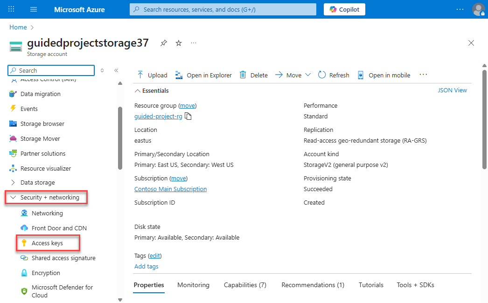
6.	For Key 1, select **Rotate key**.
7.	Read and then acknowledge the warning about regenerating the access key by selecting **Yes**.
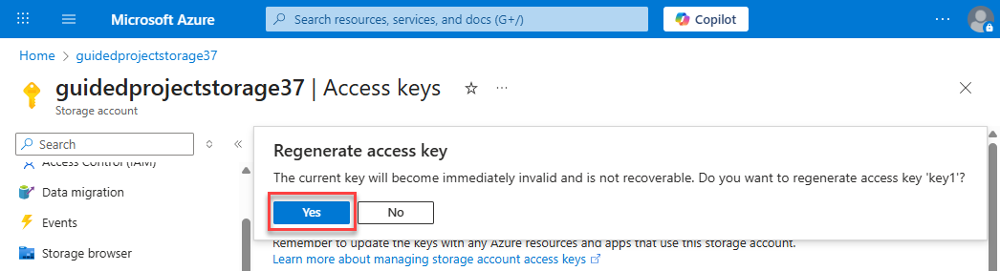
8.	Once you see the success message for rotating the access key, go back to the window or tab you used to check the SAS token and refresh the page. You should receive an authentication failed error.

Congratulations, you’ve completed working with Azure storage.
