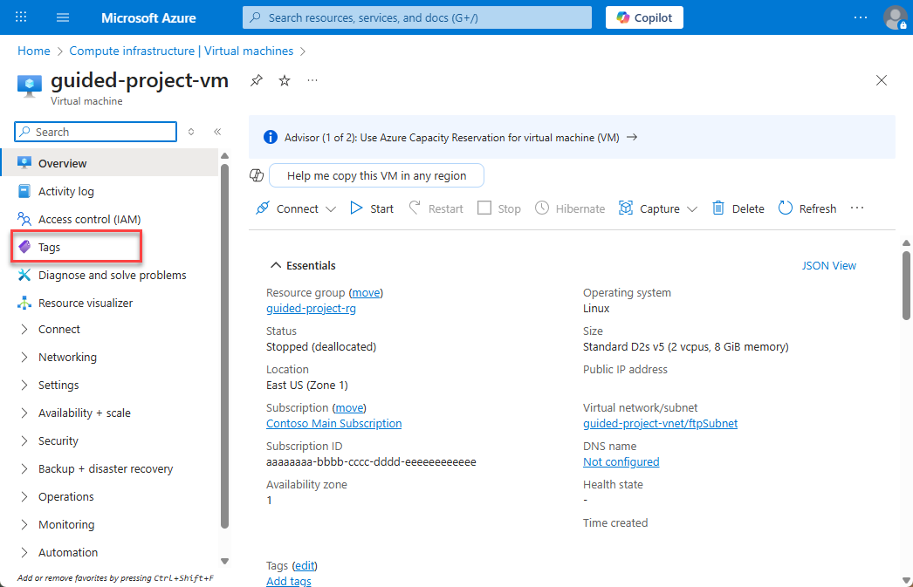
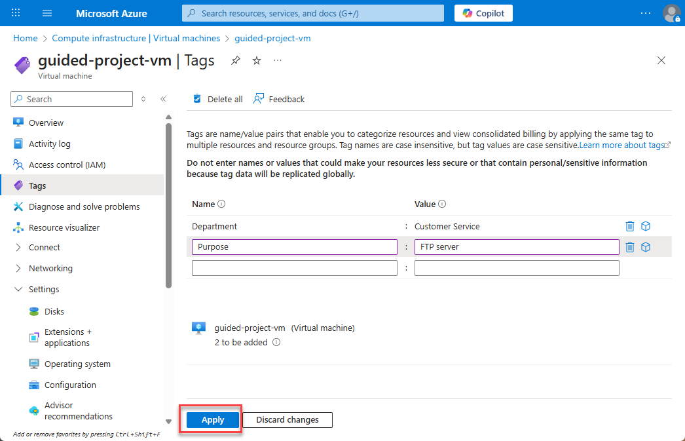
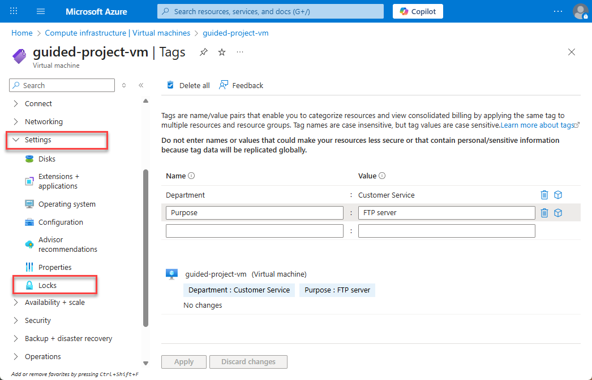
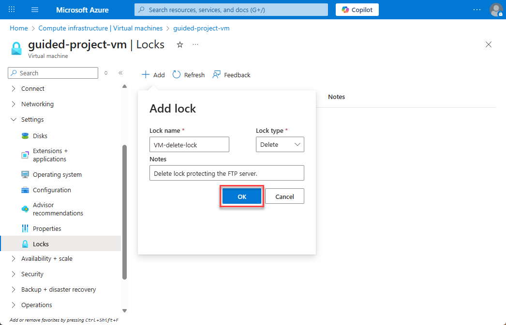
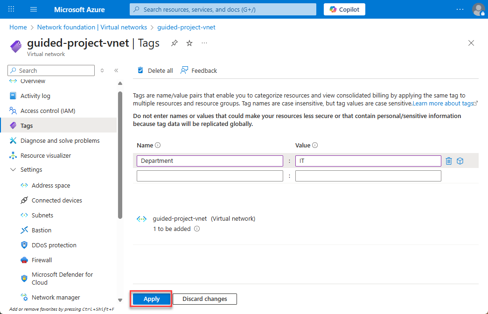

---
lab:
    title: 'Exercise – Manage tags and locks'
---

# Exercise – Manage tags and locks
If you’ve completed the previous exercises, you’ve managed added a subnet to a virtual network, made changes to a virtual machine, and worked with an Azure storage account. The final set of tasks for this guided project focus around working with **tags** and **resource locks** to help manage and monitor your environment. During this exercise you’ll go back into each of the areas you’ve already worked to add tags, locks, or a combination of both.

## Scenario
Pleased with your progress so far, the Azure admin hopes that you can wrap a few things up to help with monitoring and protecting resources. They want to know that someone can’t accidentally get rid of the virtual machine that’s running as an FTP server, and they want a quick way to see what department is using resources and the resource’s purpose.

##  Manage tags and locks on VMs
Adding tags to resources is a quick way to be able to group and organize resources. Tags can be added at different levels, giving you the ability to organize and group resources at a level that makes sense for you.

### Add tags to a virtual machine
You’ll start by adding a pair of tags to the virtual machine. One tag will be to identify the purpose of the virtual machine and the other will be to indicate the department the machine supports.
1.	Login to Microsoft Azure at [https://portal.azure.com](https://portal.azure.com)
2.	From the Azure portal home page, in the search box, enter **virtual machines**.
3.	Select **virtual machines** under services.
4.	Select the **guided-project-vm** virtual machine.
5.	From the menu pane, select **Tags**.

6.	On one line for **Name** enter `Department` and for **Value** enter `Customer Service`
7.	On the next line, for **Name** enter `Purpose` and for **Value** enter FTP Server`.
8.	Select **Apply**.

While you’re working on the virtual machine, it’s a great time to add a resource lock.

### Add a resource lock to a VM
1.	If necessary, expand the **Settings** submenu.
2.	Select **Locks**.

3.	Select **+ Add**.
4.	For the name, enter `VM-delete-lock`.
5.	For the **Lock type**, select **Delete**.
6.	You may enter a note to help remind you why you created the lock.
7.	Select **OK**.

That’s it. Now the VM is protected from deletion and has tags assigned to help track use. Time to move onto the network.

1.	Select **Home** to return to the Azure portal home page.

## Add tags to network resources
1.	From the Azure portal home page, in the search box, enter **virtual networks**.
2.	Select **virtual networks** under services.
3.	Select the **guided-project-vnet** network.
4.	From the menu pane, select **Tags**.
> **Note:** Notice that now you can select an existing tag to apply or add a new tag. You can also select just the name or value and apply create something new in the other field.
5.	For the **Name** select **Department**.
6.	For the **Value** enter **IT**.
7.	Select **Apply**.

Now both the VNet and VM have are organized.

1.	Select **Home** to return to the Azure portal home page.
