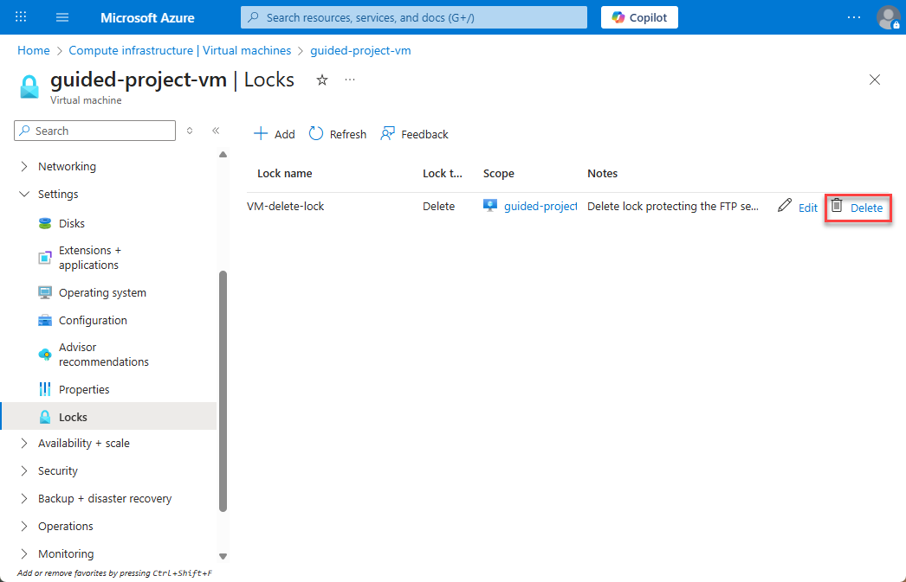
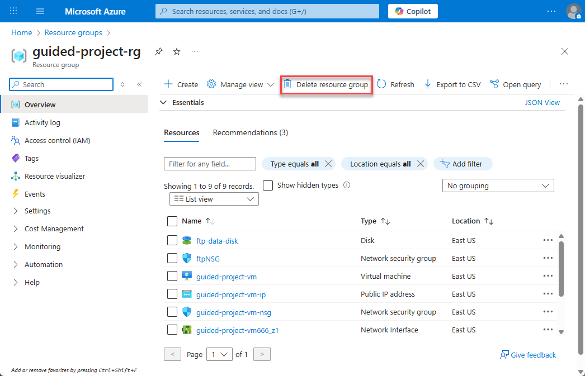
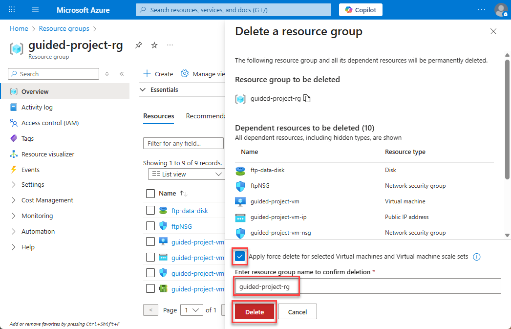
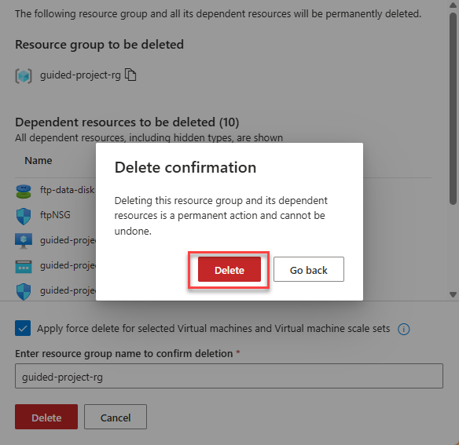

---
lab:
    title: 'Exercise – Clean up'
---
# Exercise – Clean up
> **Warning:** Failure to complete this **Clean up** task could result in unexpected Azure costs. This task will remove resources created during this guided project.

## Remove delete locks
If you attempt to delete a resource with a delete lock, you’ll receive a warning that the operation failed due to a delete lock being in place. To avoid that, it’s important to clear delete locks from resources you intend to delete **before** issuing the delete command.
1.	Login to Microsoft Azure at [https://portal.azure.com](https://portal.azure.com)
2.	From the Azure portal home page, in the search box, enter **virtual machines**.
3.	Select **virtual machines** under services.
4.	Select the **guided-project-vm** virtual machine.
5.	If necessary, expand the **Settings** submenu.
6.	Select **Locks**.
7.	Select **Delete** on the line for the VM-delete-lock.

8. On the pop-up window, select **Delete** to confirm deletion of the lock.

Once the delete lock is removed, you’ll be able to delete the VM. While this was the only delete lock required by the exercise, if you applied other delete locks during the exercise, remove them now. When you’re done, select **Home** to return to the Azure portal home page.

## Delete the project resource group
A key benefit of using resource groups is the ability to rapidly delete all of the resources assigned to a resource group at once.
1.	From the Azure portal home page, in the search box, enter **Resource groups**.
2.	Select **resource groups** under services.
3.	Select the **guided-project-rg** resource group.
4.	Select **Delete resource group**.

5.	Select **Apply force delete…**
6.	Enter `guided-project-rg` in the confirmation box.
7.	Select **Delete**.

8.	On the Delete confirmation pop-up, select **Delete**.

It will approximately 5 minutes before the resource group is fully deleted. You’ll need to refresh the resource group page every few minutes until the guided-project-rg is gone to confirm complete deletion.

> **Important:** Recall at the beginning of the Guided Project you checked for a **NetworkWatcherRG** resource group. If there WAS a NetworkWatcherRG when you started, then you’re finished. However, if the NetworkWatcherRG was created for the guided project, you’ll need to delete the NetworkWatcherRG as well following a nearly identical process.

If you don’t need to delete the NetworkWatcherRG, you can head back to Learn now and complete the module. If you need to delete the NetworkWatcherRG, continue on for instructions.

## Delete the NetworkWatcherRG

> **Important:** If the NetworkWatcherRG existed prior to starting the guided project, do not delete it as part of the guided project clean up.

1.	From the Azure portal home page, in the search box, enter **Resource groups**.
2.	Select **resource groups** under services.
3.	Select the **NetworkWatcherRG** resource group.
4.	Select **Delete resource group**.
5.	Enter `NetworkWatcherRG` in the confirmation box.
6.	Select Delete.
7.	On the Delete confirmation pop-up, select **Delete**.

It will approximately 5 minutes before the resource group is fully deleted. You’ll need to refresh the resource group page every few minutes until the NetworkWatcherRG is gone to confirm complete deletion.

Congratulations – you’ve finished the Guided Project and the clean up task at the end. Now head back to Learn to finish the rest of the module.

